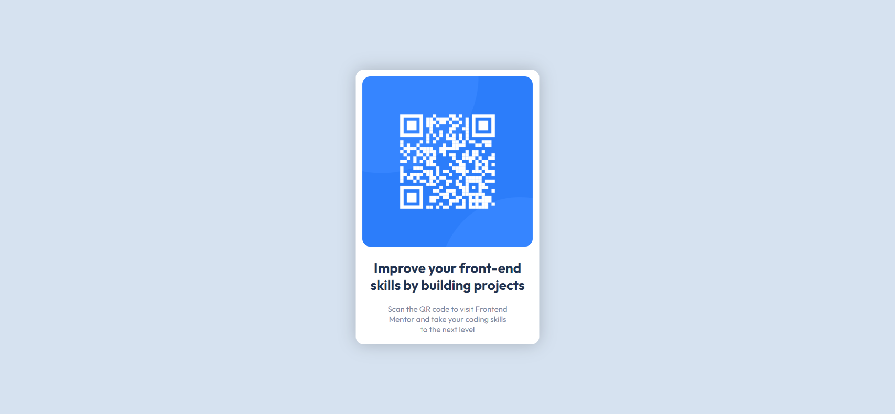

# Frontend Mentor - QR code component solution

This is a solution to the [QR code component challenge on Frontend Mentor](https://www.frontendmentor.io/challenges/qr-code-component-iux_sIO_H). Frontend Mentor challenges help you improve your coding skills by building realistic projects.

## Overview

### Screenshot

### Links

- Site URL: [GitHub](https://gabrielsapassos.github.io/qr-code-component-solution/)

## My process

### Built with

- Semantic HTML5 markup
- CSS custom properties
- Flexbox
- CSS Grid

### Continued development

Use this section to outline areas that you want to continue focusing on in future projects. These could be concepts you're still not completely comfortable with or techniques you found useful that you want to refine and perfect.

### Useful resources

- [IA Codium (Free)](https://codeium.com/) - This helped me for any problems I had developing the website.

## Author

- Website - [Gabriel Santana](https://github.com/gabrielsapassos)
- Frontend Mentor - [@gabrielsapassos](https://www.frontendmentor.io/profile/gabrielsapassos)